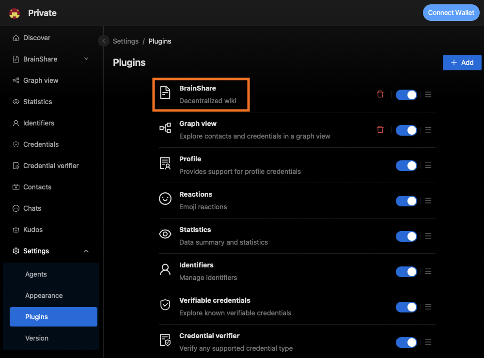
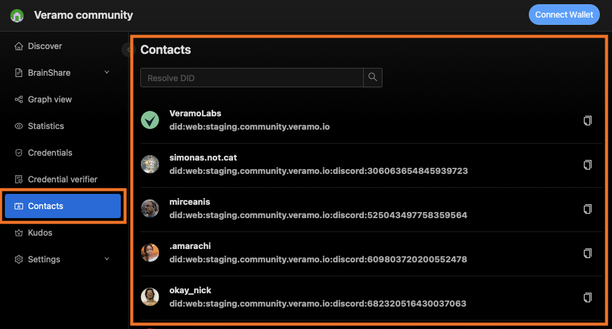
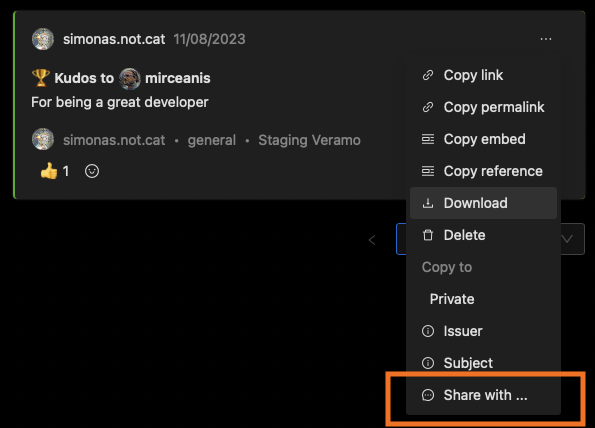

# @veramo-community/agent-explorer-plugin

This package defines the common interface for an agent explorer plugin.

## Usage

Plugins have an init function that returns a configuration object.
The configuration object defines locations in the `agent-explore` UI that will get modified by the plugin as well as
some of the methods it will use from the associated Veramo agent.

### Example

A [plugin](https://github.com/veramolabs/agent-explorer/blob/main/packages/agent-explore/src/plugins/contacts/index.tsx#L9) that adds a new menu item and a new page to the UI to manage some contacts.

```tsx
import { IPlugin } from '@veramo-community/agent-explorer-plugin';

const Plugin: IPlugin = {
  init: () => {
    return {
      config: {
        enabled: true,
        url: 'core://contacts',
      },
      name: 'Contacts',
      description: 'Explore contacts',
      icon: <ContactsOutlined />,
      requiredMethods: ['dataStoreORMGetIdentifiers'],
      routes: [
        {
          path: '/contacts',
          element: <Contacts />,
        },
        {
          path: '/contacts/:id',
          element: <Identifier />,
        },
      ],
      menuItems: [
        {
          name: 'Contacts',
          path: '/contacts',
          icon: <ContactsOutlined />,
        },
      ],
      getCredentialContextMenuItems
    }
  }
};

```

### Implementations

- [veramolabs/agent-explorer-plugin-brainshare](https://github.com/veramolabs/agent-explorer-plugin-brainshare)
- [veramolabs/agent-explorer-plugin-gitcoin-passport](https://github.com/veramolabs/agent-explorer-plugin-gitcoin-passport)
- [veramolabs/agent-explorer-plugin-kudos](https://github.com/veramolabs/agent-explorer-plugin-kudos)
- [veramolabs/agent-explorer-plugin-graph-view](https://github.com/veramolabs/agent-explorer-plugin-graph-view)
- [veramolabs/agent-explorer-plugin-social-feed](https://github.com/veramolabs/agent-explorer-plugin-social-feed)
- [veramolabs/agent-explorer-plugin-developer-tools](https://github.com/veramolabs/agent-explorer-plugin-developer-tools)
- [simonas-notcat/agent-explorer-plugin-codyfight](https://github.com/simonas-notcat/agent-explorer-plugin-codyfight)

## Plugin API

### `name`, `description`, `icon`

```ts  
/** The plugin name */
name: string;

/** A short description of the plugin */
description: string;

/** The plugin icon */
icon?: React.ReactNode;
```

These will be displayed in the plugins list



### `routes`

```ts
/** An array of routes to be added to the explorer */
routes?: IRouteComponent[];  
```
Example:
```ts
routes: [
  {
    path: '/contacts',
    element: <Contacts />,
  },
  {
    path: '/contacts/:id',
    element: <Identifier />,
  },
]
```

### `menuItems`

```ts
/** An array of menu items to be added to the explorer */
menuItems?: ExtendedMenuDataItem[];
```

Example:
```ts
menuItems: [
  {
    name: 'Contacts',
    path: '/contacts',
    icon: <ContactsOutlined />,
  },
],
```



### `requiredMethods`

```ts
/** An array of methods that the plugin requires to be implemented by the agent*/
requiredMethods: string[];
```

Example:
```ts
requiredMethods: ['dataStoreORMGetIdentifiers'],
```

If the agent does not implement the required methods, the plugin will be loaded but the menu item will not be shown.

### `hasCss`

```ts
/** Does the plugin provide custom css */
hasCss?: boolean;
```

Example: [Brainshare](https://github.com/veramolabs/agent-explorer-plugin-graph-view/tree/main/dist) plugin provides custom css.

### `agentPlugins`

```ts
/** Veramo agent plugins accesable by all explorer plugins */
agentPlugins?: IAgentPlugin[];
```

### `messageHandlers`

```ts
/** Veramo agent message handlers */
messageHandlers?: AbstractMessageHandler[];
```

Example: [Chats plugin](https://github.com/veramolabs/agent-explorer/blob/main/packages/agent-explore/src/plugins/chats/index.tsx#L20)

### `getCredentialContextMenuItems`

```ts
/** Menu items for the credential context menu */
getCredentialContextMenuItems?: (credential: UniqueVerifiableCredential) => MenuProps['items'];
```



### `getIdentifierContextMenuItems`

```ts
/** Returns a react component for a given verifiable credential */
getCredentialComponent?: (credential: UniqueVerifiableCredential) => React.FC<IVerifiableComponentProps> | undefined;
```

Example: [Kudos plugin](https://github.com/veramolabs/agent-explorer-plugin-kudos/blob/e2535b295ef91c6c85d3530313ec5ed5c5aefb4c/src/index.tsx#L32)


### `getIdentifierContextMenuItems`

```ts
/** Returns a react component that will be displayed in the identifier hover component */
getIdentifierHoverComponent?: () => React.FC<IIdentifierHoverComponentProps>;
```
Example: [Gitcoin Passport plugin](https://github.com/veramolabs/agent-explorer-plugin-gitcoin-passport/blob/main/src/index.tsx#L20)


### `getIdentifierTabsComponents`

```ts
/** Returns an array of react components and labels that will be displayed as tabs in the indentifier profile page */
getIdentifierTabsComponents?: () => Array<{ label: string, component: React.FC<IIdentifierTabsComponentProps> }>;
```

Example: [Credentials plugin]()

```ts
getIdentifierTabsComponents: () => {
  return [
    {
      label: 'Issued credentials',
      component: IdentifierIssuedCredentials,
    },
    {
      label: 'Received credentials',
      component: IdentifierReceivedCredentials,
    },
  ]
}
```


### `getCredentialActionComponents`

```ts
/** Returns an array of react components that will be displayed as action buttons in Credential component */
getCredentialActionComponents?: () => Array<React.FC<ICredentialActionComponentProps>>;
```
Example: [Reactions plugin](https://github.com/veramolabs/agent-explorer/blob/main/packages/agent-explore/src/plugins/reactions/index.tsx#L33)


### `getMarkdownComponents`, `getRemarkPlugins`

```ts
/** react-markdown Components for custom markdown rendering */
getMarkdownComponents?: () => Partial<Components> | undefined;

/** remark plugins for custom markdown manipulations */
getRemarkPlugins?: () => PluggableList;
```

Example: [Brainshare plugin](https://github.com/veramolabs/agent-explorer-plugin-brainshare/blob/4de0d677ffd907dcbaf59028647e45967fdd9c85/src/index.tsx#L105)