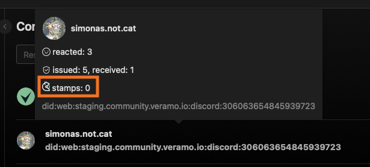
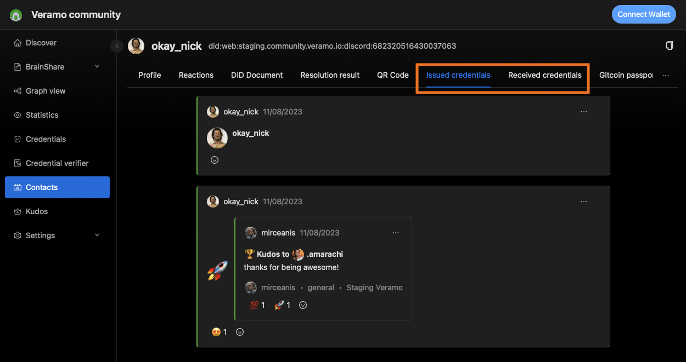

# @veramo-community/agent-explorer-plugin

This package defines the common interface for an agent explorer plugin.

## Usage

Plugins have an init function that returns a configuration object.
The configuration object defines locations in the `agent-explore` UI that will get modified by the plugin as well as
some of the methods it will use from the associated Veramo agent.

### Example

A [plugin](https://github.com/veramolabs/agent-explorer/blob/main/packages/agent-explore/src/plugins/contacts/index.tsx#L9) that adds a new menu item and a new page to the UI to manage some contacts.

```tsx
import { IPlugin } from '@veramo-community/agent-explorer-plugin';

const Plugin: IPlugin = {
  init: () => {
    return {
      config: {
        enabled: true,
        url: 'core://contacts',
      },
      name: 'Contacts',
      description: 'Explore contacts',
      icon: <ContactsOutlined />,
      requiredMethods: ['dataStoreORMGetIdentifiers'],
      routes: [
        {
          path: '/contacts',
          element: <Contacts />,
        },
        {
          path: '/contacts/:id',
          element: <Identifier />,
        },
      ],
      menuItems: [
        {
          name: 'Contacts',
          path: '/contacts',
          icon: <ContactsOutlined />,
        },
      ],
      getCredentialContextMenuItems
    }
  }
};

```

### Example implementations

- [veramolabs/agent-explorer-plugin-brainshare](https://github.com/veramolabs/agent-explorer-plugin-brainshare)
- [veramolabs/agent-explorer-plugin-gitcoin-passport](https://github.com/veramolabs/agent-explorer-plugin-gitcoin-passport)
- [veramolabs/agent-explorer-plugin-kudos](https://github.com/veramolabs/agent-explorer-plugin-kudos)
- [veramolabs/agent-explorer-plugin-graph-view](https://github.com/veramolabs/agent-explorer-plugin-graph-view)
- [veramolabs/agent-explorer-plugin-social-feed](https://github.com/veramolabs/agent-explorer-plugin-social-feed)
- [veramolabs/agent-explorer-plugin-developer-tools](https://github.com/veramolabs/agent-explorer-plugin-developer-tools)
- [simonas-notcat/agent-explorer-plugin-codyfight](https://github.com/simonas-notcat/agent-explorer-plugin-codyfight)

All of these plugins use the same project structure.

You can use any of them as a template for your own plugin.

### Local development

- Clone any of the above mentioned plugin repositories
- Run `pnpm i`
- Run `pnpm serve` to start the development server
- Run `pnpm ngrok` to open a tunnel to your local server
- Copy the ngrok url and paste it in the `agent-explore` plugin configuration

```
https://EXAMPLE.ngrok.app/plugin.js
```

https://github.com/veramolabs/agent-explorer/assets/16773277/0fda3289-1d71-4559-97d4-786069e3a334

### Publishing

- Run `pnpm build`
- Commit changes and push to github
- Use the github url to load the plugin in `agent-explore`

```
https://cdn.jsdelivr.net/gh/{USER}/{REPO}/dist/plugin.js
```
## Plugin API

### `name`

The plugin name 

```ts  
name: string;
```

### `description`

A short description of the plugin

```ts
description: string;
```

### `icon`

The plugin icon
```ts
icon?: React.ReactNode;
```

These will be displayed in the plugins list


### `routes`

```ts
/** An array of routes to be added to the explorer */
routes?: IRouteComponent[];  
```
Example:
```ts
routes: [
  {
    path: '/contacts',
    element: <Contacts />,
  },
  {
    path: '/contacts/:id',
    element: <Identifier />,
  },
]
```

### `menuItems`

An array of menu items to be added to the explorer

```ts
menuItems?: ExtendedMenuDataItem[];
```

Example:
```ts
menuItems: [
  {
    name: 'Contacts',
    path: '/contacts',
    icon: <ContactsOutlined />,
  },
],
```


### `requiredMethods`

An array of methods that the plugin requires to be implemented by the agent.

If the agent does not implement the required methods, the plugin will be loaded but the menu item will not be shown.
```ts
requiredMethods: string[];
```

Example:
```ts
requiredMethods: ['dataStoreORMGetIdentifiers'],
```


### `hasCss`

Does the plugin provide custom css

```ts
hasCss?: boolean;
```

Example: [Brainshare](https://github.com/veramolabs/agent-explorer-plugin-graph-view/tree/main/dist) plugin provides custom css.

### `agentPlugins`

Veramo agent plugins accesable by all explorer plugins

```ts
agentPlugins?: IAgentPlugin[];
```

### `messageHandlers`

Veramo agent message handlers

```ts
messageHandlers?: AbstractMessageHandler[];
```

Example: [Chats plugin](https://github.com/veramolabs/agent-explorer/blob/main/packages/agent-explore/src/plugins/chats/index.tsx#L20)

### `getCredentialContextMenuItems`

Menu items for the credential context menu

```ts
getCredentialContextMenuItems?: (credential: UniqueVerifiableCredential) => MenuProps['items'];
```

Example [Chats plugin](https://github.com/veramolabs/agent-explorer/blob/7614ba2a25423aa6304013738af8e67c625394cd/packages/agent-explore/src/plugins/chats/menu.tsx#L8)

```ts
{
  key: 'sendto',
  label: 'Share with ...',
  icon: <MessageOutlined />,
  onClick: handleSendTo
}
```


### `getCredentialComponent`

Returns a react component for a given verifiable credential

```ts
getCredentialComponent?: (credential: UniqueVerifiableCredential) => React.FC<IVerifiableComponentProps> | undefined;
```

Example: [Kudos plugin](https://github.com/veramolabs/agent-explorer-plugin-kudos/blob/e2535b295ef91c6c85d3530313ec5ed5c5aefb4c/src/index.tsx#L32)


### `getIdentifierHoverComponent`

Returns a react component that will be displayed in the identifier hover component

```ts
getIdentifierHoverComponent?: () => React.FC<IIdentifierHoverComponentProps>;
```
Example: [Gitcoin Passport plugin](https://github.com/veramolabs/agent-explorer-plugin-gitcoin-passport/blob/main/src/index.tsx#L20)



### `getIdentifierTabsComponents`

Returns an array of react components and labels that will be displayed as tabs in the indentifier profile page

```ts
getIdentifierTabsComponents?: () => Array<{ label: string, component: React.FC<IIdentifierTabsComponentProps> }>;
```

Example: [Credentials plugin]()

```ts
getIdentifierTabsComponents: () => {
  return [
    {
      label: 'Issued credentials',
      component: IdentifierIssuedCredentials,
    },
    {
      label: 'Received credentials',
      component: IdentifierReceivedCredentials,
    },
  ]
}
```


### `getCredentialActionComponents`

Returns an array of react components that will be displayed as action buttons in Credential component

```ts
getCredentialActionComponents?: () => Array<React.FC<ICredentialActionComponentProps>>;
```

Example: [Reactions plugin](https://github.com/veramolabs/agent-explorer/blob/main/packages/agent-explore/src/plugins/reactions/index.tsx#L33)


### `getMarkdownComponents`

`react-markdown` Components for custom markdown rendering

```ts
getMarkdownComponents?: () => Partial<Components> | undefined;
```
### `getRemarkPlugins`

`remark` plugins for custom markdown manipulations

```ts
getRemarkPlugins?: () => PluggableList;
```

Example: [Brainshare plugin](https://github.com/veramolabs/agent-explorer-plugin-brainshare/blob/4de0d677ffd907dcbaf59028647e45967fdd9c85/src/index.tsx#L105)